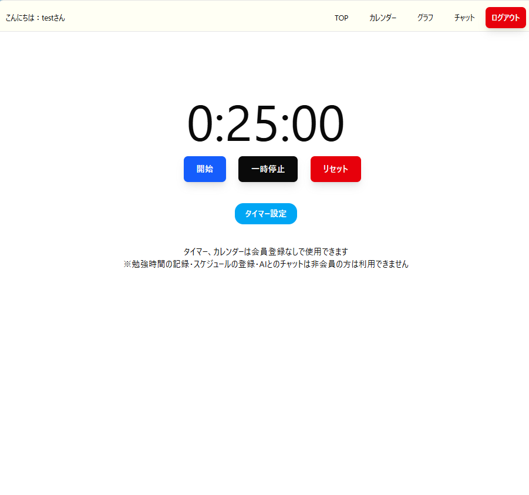
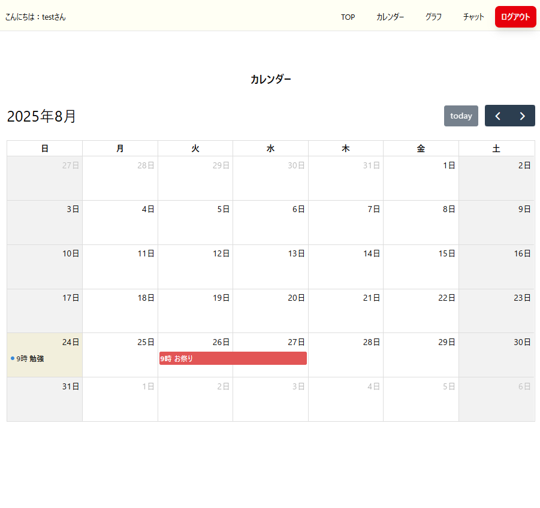

# AIキャラと一緒に勉強できるポモドーロタイマーアプリ
  

## URL
https://pomodoro-tools.com/

### ⚠️ご利用上の注意（AI機能の利用は必要最低限でお願いします）
- 本アプリにはAI（Chat機能など）を活用した機能があります。
- この機能の利用には外部APIを経由しており、一定の使用量を超えると開発者側に課金が発生します。

#### お願い
- AI機能のご利用は必要最小限でお願いします。
- 特に、連続で大量の質問やリクエストを送る行為はご遠慮ください。
- 無料提供中のため、みなさまのご配慮をお願いします。

## 開発背景
未経験からエンジニアを目指すにあたり、個人開発をすることにしました。  
勉強時にポモドーロ・テクニックを活用していたこと、また無料で利用できる既存サービスで勉強時間をグラフ化・カレンダーでTODOの管理ができるものが見つからず、作成しました。

## 使用技術一覧
- 言語  

- ライブラリ・フレームワーク  

- ミドルウェア  

- その他  

## 🏗 インフラ構成

本アプリは以下の構成でデプロイされています：

- **VPS**：さくらのVPS(Rocky Linux)
- **Docker Compose** を用いて以下をコンテナで管理：
  - Frontend（Next.js）
  - Backend（FastAPI）
  - Database（PostgreSQL）
  - Nginx（リバースプロキシとして）
- **HTTPS対応**：Let's Encrypt（certbot）にてSSL証明書を取得
- **ドメイン管理**：ムームードメインを使用

## 主な機能

#### タイマーページ（会員登録なしで利用可）

デフォルトで集中時間25分・小休憩5分・休憩20分になっています。
必要に応じて時間変更が可能です。

#### ログイン・新規会員登録ページ
  
どちらもバリデーションが表示されるようになっており、エラーの内容が分かりやすくなっています。  

#### グラフページ
  
ユーザーが選んだ日から1週間の勉強時間をグラフ表示することが可能です。  
また今までの勉強時間の累計もデフォルトで表示されます。  

#### カレンダーページ
  
予定を登録することが可能です。  
表示色を変更することができるので、カテゴリー別に登録することが可能です。  

#### チャットページ
  
ＡＩとのチャットを利用することができます。キャラクターのイラストは自作しました。  

カレンダーページの予定登録・グラフ・チャットはログインユーザーのみ利用可能です。  
非ログインユーザーが予定登録・ページへのアクセスを試みた場合は、ログインページにリダイレクトされます。  

またトークンの有効期限が切れた場合も再ログインを促します。  

## ER図
 

## 環境変数

| 変数名   | 役割 | 
| ------ | ---- |
| POSTGRES_USER | PostgreSQLのユーザー名  |
| POSTGRES_PASSWORD   | PostgreSQLのパスワード   |
| POSTGRES_DB   | PostgreSQLのデータベース名   |
| POSTGRES_PORT   | PostgreSQLのポート番号   |
| POSTGRES_URL   | PostgreSQLの接続URL  |
| FRONTEND_PORT   | フロントエンドのポート番号   |
| BACKEND_PORT   | バックエンドのポート番号   |
| SECRET_KEY   | JWT認証で使用するセキュリティーキー   |
| ALGORITHM  | パスワードハッシュ化のアルゴリズム   |
| ACCESS_TOKEN_EXPIRE_MINUTES   | アクセストークンの有効期限   |
| GROQ_API_KEY   | GroqのAPIキー   |

## 今後追加予定の機能
- タイマー設定の保存

